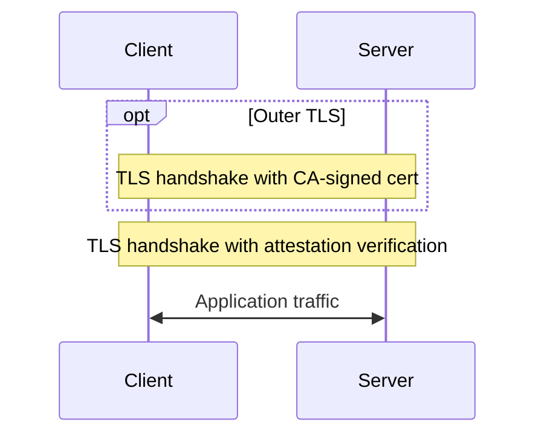

# attested-tls

Primitives for attested TLS channels.

This workspace contains components for a protocol that binds confidential
computing attestation evidence to TLS certificates.

- An outer TLS session authenticates the service using a standard CA-signed
  certificate.  This is optional.
- An inner TLS session uses a certificate with attestation evidence embedded in
  an extension.
- The attestation is verified during the inner TLS handshake and is bound to
  the details of the certificate.

The idea is that the outer identity proves ownership of the domain and can
potentially persist across CVM re-starts to avoid relying on the CA at boot.

The inner identity represents particular CVM lifetime (for example, it can
persist across service restarts, but must not persist across CVM reboots, let
alone CVM image updates).

More details in the individual READMEs of the provided crates:

- [`attested-tls`](./crates/attested-tls) - provides attested TLS via X509
  Certificate extensions and a custom certificate verifier.
- [`nested-tls`](./crates/nested-tls) - provides two TLS sessions, such that
  the outer session can be used for a CA signed certificate and the inner
  session for attestation.
- [`attestation`](./crates/attestation) - provides attestation generation,
  verification and measurement handling.
- [`pccs`](./crates/pccs) provides collateral fetching and caching for DCAP
  verification.
- [`mock-tdx`](./crates/mock-tdx) - generates deterministic mock TDX DCAP
  quotes, collateral, and trust roots for tests and development on non-TDX
  hardware.
- [`attestation-provider-server`](./crates/attestation-provider-server) -
  HTTP server and client for attestation generation and verification.

The included `shell.nix` file can be used with `nix-shell`, `direnv`, or `nix
develop` to add the dependencies needed by the optional `azure` feature of the
`attestation` crate on Linux.  See the
[`attestation` crate readme](./crates/attestation) for details.
